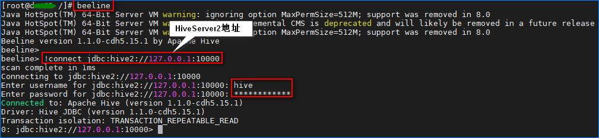
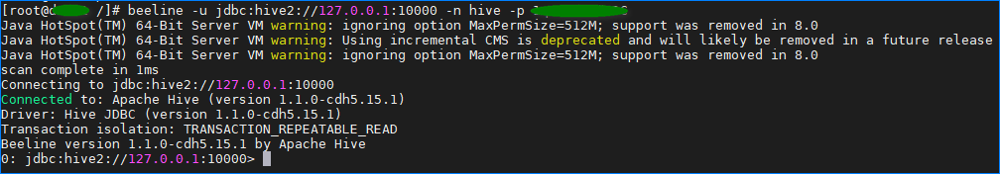

# 1.简介

> The Apache Hive ™ data warehouse software facilitates reading, writing, and managing large datasets residing in distributed storage using SQL. Structure can be projected onto data already in storage. A command line tool and JDBC driver are provided to connect users to Hive.

Hive是一个基于 Hadoop的数据仓库软件，其核心在于**存储**和**分析**数据。

Hive可以存储大数据量（PB级）的**结构化**数据，同时支持绝大部分 SQL语法。可以在命令行直接使用 SQL分析数据，也可以使用 Spark程序或者 Java程序来操作其中的数据。

更多权威内容见官网：[Apache Hive TM](https://hive.apache.org/)

# 2.名词解释

- **Beeline**

  Beeline是 Hive 0.11版本引入的新命令行客户端工具,它是基于 SQLLine CLI的 JDBC客户端。

- **Hive Metastore Server**

​		元数据服务，负责提供 hive里面创建的数据库、表、分区和数据存储目录等元数据。元数据默认存储在自带的 derby数据库中，但是		生产上一般使用 MySQL来进行存储。

- **HiveServer2**

  HiveServer2（HS2）是一个服务端接口，使远程客户端可以执行对 hive的查询并返回结果。 启动 hiveServer2服务后，就可以使用jdbc，odbc，或者 thrift的方式连接。

- **MapReduce**

  MapReduce是一种大数据量处理的编程模型，也是 hive**默认的执行引擎**，其他的执行引擎还有 spark。

- **Partition**

  分区，为了更加快速的过滤数据，生产上一般都会给表分区，比较常见的分区方式有按天、按月和按批次分区。

# 3.Hive命令行

使用 **beeline**就可以进入 hive的命令行，如下：



也可以直接指定**服务器地址**和**账户信息**，如下：

```shell
beeline -u jdbc:hive2://<hive-server2>:10000 -n <user> -p <password>
```



**退出命令行**：

```sql
# 为了避免丢失 hive历史命令，建议使用此命令退出
!exit
```

# 4.数据库及表操作

## 4.1 数据库操作

首先使用 beeline命令进入到 hive的命令行。

1. **查看现有的数据库**

   ```sql
   show databases;
   ```

2. **切换数据库**

   ```sql
   use db2;

3. **创建数据库**

   ```sql
   # --1.直接创建数据库，若数据库已存在会报错
   create database db5;
   
   # --2.先判断数据库是否存在，不存在则创建，反之什么都不做
   create database if not exists db5;

4. **删除数据库**

   ```sql
   drop database db5;

## 4.2 表操作

下面的命令均需要在 hive命令行中操作。

1. **查看表**

   ```sql
   # 先切换到目标数据库
   use db5;
   show tables;

2. **创建表**

   ```sql
   # --1.创建普通表，同样支持 if not exists命令
   # 常用的数据类型有：string,int,date,float
   create table table2(
     field1 string,
     field2 int
   );
   
   # --2.创建分区表
   # 首先开启分区
   set hive.exec.dynamic.partition=true; 
   set hive.exec.dynamic.partition.mode=nonstrict;
   # 建表
   create table table3(
     field1 string,
     field2 date 
   )partitioned by(day string)
   row format delimited fields terminated by '\t';
   
   # --3.从现有表创建一张新表，两张表的 schema信息完全一样
   create table like table3;

3. **删除表**

   ```sql
   drop table table3;
   ```

4. **修改表**

   ```sql
   alter table table2 rename to table002;
   ```

5. **清空表数据**

   ```sql
   truncate table table2;

# 5.查询和插入数据

## 5.1 查询数据

**通过 SQL查询 hive表中的数据**：

```sql
# 查询某张表的 10条数据（与 MySQL的语法十分接近）
select * from table2 limit 10;

# 查询表中数据量
select count(*) from table2;
```

**通过 HDFS命令查看 hive表所占的存储空间**：

```shell
# /user/hive/warehouse/是 hive数据在 hdfs上存储的默认路径
# testdb01是数据库名，table2是目标表的名称
hdfs dfs -du -s -h /user/hive/warehouse/testdb01.db/table2
#6.6 G  19.7 G  /user/hive/warehouse/testdb01.db/table2
```

## 5.2 插入数据

```sql
# 往普通表插入数据
insert into table table2 values("hello",2022);

# 往分区表插入数据
insert into table table3 PARTITION(day='20220118') values("hello",2022);
```

# 6.导入和导出数据

## 6.1 导入数据

```sql
# 从本地磁盘导入数据到 hive表里面
# 此命令需要在 hive命令行里面执行
# 普通表
load data local inpath '/opt/test.csv' into table testdb01.table3;

# 分区表
load data local inpath '/opt/test.csv' into table testdb01.table3 PARTITION (day='20220118');
```

## 6.2 导出数据

```sql
# 将 hive表里面的数据以 MapReduce任务的方式导出到本地磁盘
# 此命令需要在 hive命令行里面执行
insert overwrite local directory '/tmp/table3-export' select * from testdb01.table3;
```

# 7.角色授权

一般情况下 hive账户拥有最高权限，因此可以使用 hive账户给其他账户赋权限。

```sql
# 给 root用户赋予管理员权限
create role admin;
grant all on server server1 to role admin;
grant role admin to group root;
```

# 8.总结

本文的目标是简单介绍 hive，给出 hive常见的操作，希望不了解 hive的人也能根据本文把 hive用起来。


