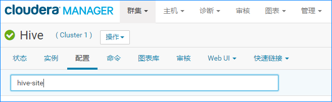

# 前言

生产上的大数据平台都会配置多个 HiveServer，在使用 JDBC这种方式连接 hive服务时，如果直接连接某个 HiveServer，当其所在机器异常时，就会导致服务不可用。因此，生产上一般都要求使用 ZooKeeper开启 HA，通过 zk去间接访问 hive服务。

这里以 **CDH 5.X**为例介绍 Hive如何通过 ZooKeeper开启 HA。

# Hive开启 HA（高可用）

1. **修改界面配置**

   打开 CDH界面，然后在 Hive配置里面搜索 hive-site，如下：

   

   然后添加如下配置项：

   ```
   hive.server2.support.dynamic.service.discovery
   true
   hive.server2.zookeeper.namespace
   hiveserver2
   ```

   

2. **重启 Hive服务**

   在 CDH主界面重启 Hive服务即可。

3. **验证**

   找一台装有 beeline客户端的服务器，然后使用下面的命令通过 zk去连接 hive服务：

   ```shell
   beeline -u 'jdbc:hive2://zk1:2181,zk2:2181,zk3:2181/;serviceDiscoveryMode=zooKeeper;zooKeeperNamespace=hiveserver2' -n <username> -p <password>
   ```

   其中 zk1，zk2，zk3是 zk所在机器的主机名，需要根据实际情况进行替换。

   如果可以正常连接 hive服务即为正确，如下：

   

# 总结

在 CDH里面 Hive通过 ZooKeeper开启 HA是一件很简单的事。

