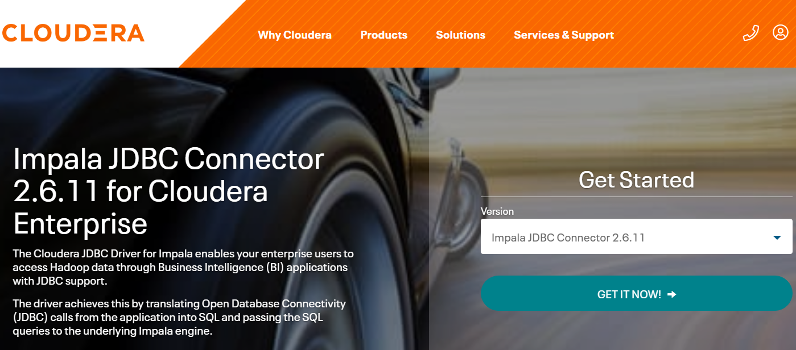
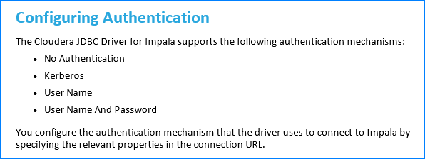
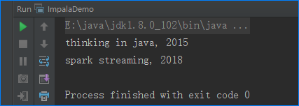

# 1.前言

本文将描述如何根据 impala官方文档使用 **java**连接 impala。

使用的 impala版本：**2.12.0**。

# 2.下载和安装 JDBC包

## 2.1 下载 JDBC包

官网下载地址：[Download Impala JDBC Connector](https://www.cloudera.com/downloads/connectors/impala/jdbc/2-6-11.html)

这里需要根据 impala的版本选择对应的 jdbc包，impala-2.12.0对应的包如下：



打开下载压缩包，可以看到**官方给的指引文档**：

​	**Cloudera-JDBC-Driver-for-Impala-Install-Guide.pdf**

## 2.2 安装 JDBC包

**借助 maven把 jar包安装到本地**：

```shell
mvn install:install-file -Dfile=D:\impala-lib\ImpalaJDBC41.jar -DgroupId=com.cloudera.impala -DartifactId=ImpalaJDBC41 -Dversion=2.6.11 -Dpackaging=jar
```

## 2.3 在 POM文件中引用

**在 pom文件中进行引用**：

```xml
<dependency>
	<groupId>com.cloudera.impala</groupId>
	<artifactId>ImpalaJDBC41</artifactId>
	<version>2.6.11</version>
</dependency>
```

# 3.编写连接代码

连接代码非常简洁，只需要 2行即可：

```java
Class.forName("com.cloudera.impala.jdbc41.Driver");
Connection connection = DriverManager.getConnection("jdbc:impala://192.168.5.5:21050;UID=impala");
```

其中 21050端口是 impala daemon的默认端口号，需要根据实际情况修改。如果出现连不上的情况，可以检查下服务器的防火墙，确认是否允许外部访问。

**UID=impala** 中的 impala是用户名，可以根据实际情况修改。

另外，需要注意的是一般生产环境都是启用了**访问认证**的，这里以 ldap为例，连接字符串如下：

```
jdbc:impala://192.168.5.5:21050;AuthMech=3;UID=impala;PWD=iala2022
```

其他的认证方式可以查看官方文档：



# 4.测试效果

由于笔者的 impala服务开启了 ldap认证，故连接字符串有所不同，**完整的代码**如下：

```java
import java.sql.Connection;
import java.sql.DriverManager;
import java.sql.PreparedStatement;
import java.sql.ResultSet;

/**
 * 连接 Impala服务样例代码
 * Created by daphnis on 2022/02/02
 */
public class ImpalaDemo {

    public static void main(String... args) throws Exception{
        Class.forName("com.cloudera.impala.jdbc41.Driver");
        Connection connection = DriverManager.getConnection("jdbc:impala://192.168.5.5:21050;AuthMech=3;UID=impala;PWD=iala5566");

        PreparedStatement ps=connection.prepareStatement("select * from testdb5.books");
        ResultSet rs=ps.executeQuery();
        while (rs.next()){
            System.out.println(String.format("%s, %s",rs.getString(1),rs.getInt(2)));
        }

        connection.close();
    }
}
```

**运行结果**：



# 5.总结

impala官方文档写得很清晰，很容易就能参考文档使用 java连接 impala。另外，不要直接使用系统原生的 api去管理连接，推荐使用阿里 **druid**来管理连接。

