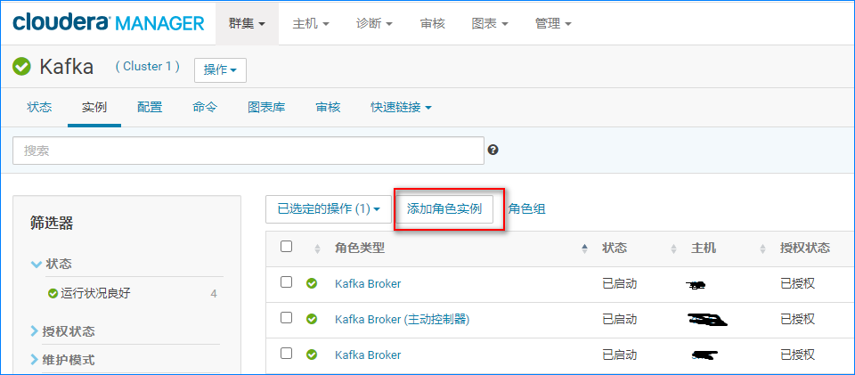
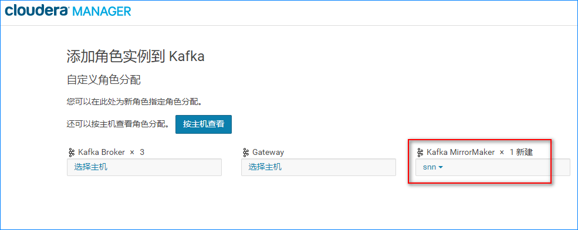
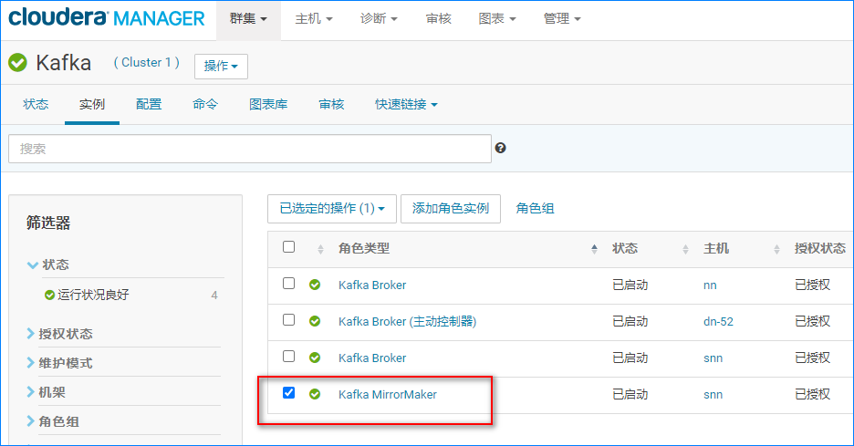

# 1.前言

MirrorMaker 是 Kafka官方提供的跨数据中心的**流数据同步方案**。原理是通过从 **原始kafka集群**消费消息，然后把消息发送到 **目标kafka集群**。操作简单，只要通过简单的 consumer配置和 producer配置，然后启动 Mirror，就可以实现准实时的数据同步。

# 2.独立 Kafka集群使用 MirrorMaker

## 2.1 开启远程连接

这里需要确保 目标Kafka集群（接收数据的那个集群）已开启远程连接，开启方法如下：

```properties
# 修改 kafka配置文件中下面两个配置
listeners=PLAINTEXT://:9092
advertised.listeners=PLAINTEXT://192.168.xx.xx:9092
```

其中 192.168.xx.xx是对外提供服务的IP，修改为目标集群的 IP即可。

## 2.2 准备 consumer.properties

这个配置文件指定**原始集群**的信息。具体内容如下：

```properties
# 原始集群的broker list
bootstrap.servers=host1:9092,host2:9093 
# 指定一个新的 id即可
group.id=test-consumer-group1
auto.offset.reset=earliest
```

## 2.3 准备 producer.properties

这个配置文件指定**目标集群**的信息。具体内容如下：

```properties
# 目标集群的broker list
bootstrap.servers=host5:9092,host6:9093
# 数据压缩方式，加快数据同步速度
compression.type=gzip 
```

## 2.4 启动 MirrorMaker开始同步数据

进入 kafka安装目录后执行下面的命令：

```shell
./kafka-mirror-maker.sh --consumer.config /opt/kafka/consumer.properties --producer.config /opt/kafka/producer.properties --whitelist topic001
```

这里就需要用到前面两个准备好的文件了，另外，**--whitelist**指定需要同步的 topic，**--blacklist**是不需要同步的，这两个符合 java正则表达式形式。

# 3.在 CDH中开启 MirrorMaker

## 3.1 界面添加 MirrorMaker实例





## 3.2 配置Broker和需要同步的Topic

这里需要**注意**：所有需要同步的 topic要预先在 **目标kafka集群**中创建。


## 3.3 重启MirrorMaker实例

前面步骤顺利执行完，界面会多一个 Kafka MirrorMaker实例，如下，重启即可



# 4.总结

CDH对 Kafka MirrorMaker的支持度不错，稳定性也能经得起时间的检验。另外，这种备份方式属于实时备份，很适合对数据完整性和及时性要求较高的项目，能最大程度地确保通过 kafka流转的数据的及时可用。还有一个好处是，当 kafka集群1因为某种原因无法工作时，可以迅速切换到集群2，且两个集群的数据几乎一致。

