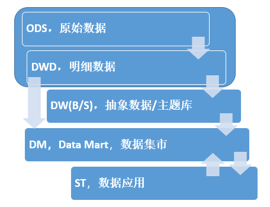

# 前言

设想有一批各种类型的离线数据（文本、csv、Excel 等），我们如何挖掘这些数据背后的价值，分析这些数据之间的关联？

很容易想到的就是，写程序把每种数据按照某种规则抽取出来放到关系型数据库中进行分析。

**这样做可能存在什么样的问题？**

1. 按照某种规则进行抽取，是否会导致原始数据信息的丢失？

2. 因为前期设计不足或者后期需求变化导致数据的重复处理？
3. 面对上千亿，甚至上万亿的数据，如何进行分析？

面对上面这些问题，现在比较常见的解决方案是 **基于大数据平台构建数据仓库**。

下面对数据仓库的设计和技术选择，结合自己的工作经历谈一些看法。

# 设计数据仓库的分层模型

## **1. 先看下常见的数仓分层方式（阿里五层模型）**

- **ODS**，Operational Data Store，**原始数据**

  数据准备区，数据来源是各业务系统，表结构与原始表一致，增加导入时间，对数据不做清洗转换。

- **DWD**，Data Warehouse Detail，**明细数据**

  数据来自 ODS，将增量数据进行合并生成**全量数据**，对数据不做清洗转换，方便后期进行**溯源**。

- **DW(B/S)**

  基于 DWD 的数据，可以进行2个维度的数据抽取聚合，期间需要进行数据清洗和转换。

  B：Base，公共维度的数据。

  S：Service，面向主题的宽表。

- **DM**，Data Mart，**数据集市**

  数据挖掘，自定义查询，应用集市。

- **ST**，**数据应用**

  前端报表展现，主题分析。

**下面是各层的依赖关系和数据流向图：**

基于 Hive 来实现前三层是非常合适的，hive 的数据存储在 hdfs 上。hdfs 的扩容是很容易的，故大数据量不再成为问题。另外 hive 提供了类似 sql 的查询语句，提供了无需编程就可以对海量数据进行查询分析的能力。

实际应用中 **ODS 和 DWD** 一般可以合为一层，建一个库特地用来存放原始数据，务必要增加一个导入时间的字段，后期会发现有很多好处。

**DW** 可以细分为抽象的公共数据和主题数据。抽象的公共数据，可以理解为设计一种**非常通用的抽取规则**，适用于大部分原始数据。主题数据，这个粒度更细一些，将原始数据进行**分类**，同一类别的数据放到同一张表里，方便应用进行对接。

**DM** 即融入了一些业务逻辑，将 DW 层的数据进行了一些处理和分析，并将结果根据需求存到不同的存储系统里。比如 本月最受欢迎的商品、购买力较高的用户等。有时也会直接对接原始数据，针对单表进行分析还好，如果是多表可能存在效率问题，而且这种方式跟原始数据耦合度太高了，不太推荐这种方式。

**ST** 这个就理解为对 DM 计算好的数据进行展示的界面，也可以是跟用户实时交互的，比如 用户输入一些分析参数，DM 层将结果计算好后再展现给用户。

## 2. 需要设置分区字段吗？如果需要，如何设计分区方案？

可以先看一个 hdfs 的路径：/apps/hive/warehouse/origin.db/shopping

仔细看一下，这个其实就是 hive 数据在 hdfs 上的存储位置。如果不设置分区，那么所有的数据都将放到 shopping 这个目录下，每次查询就需要遍历一遍所有的文件，想想有点可怕。

**数据量大且数据是多次入的，那么设置分区字段是很有必要的。**

**下面看下两种比较好的分区方式：**

- **按批次号分区**

  比如：

    /apps/hive/warehouse/origin.db/shopping/sp001

    /apps/hive/warehouse/origin.db/shopping/sp002

  这种分区方法适合数据是分批入的，每次入数据时设置一个批次号。这样在分析数据时可以指定分析某个批次或者某些批次的数据，可以减少输入数据的大小，加快分析过程。

- **按时间分区**

  比如：

    /apps/hive/warehouse/origin.db/shopping/202001 或者   /apps/hive/warehouse/origin.db/shopping/202001/20200115

  这种分区方法适合准实时（或者按月、按天）接入的数据，这种方式很通用，也很实用。比如 某个需求是分析用户最近一月的商品浏览记录。

# 根据每层的特点选用技术

这里主要谈一下前四层实现时涉及到的技术和存储系统。

# 实现过程可能遇到的困难

## 1. hive 数据如何实现更新

## 2. hive sql 执行慢

布隆过滤器

# 总结