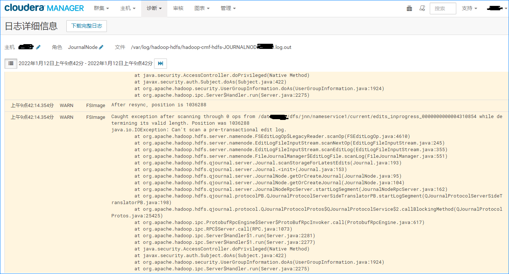

# 1.现象

CDH集群 HDFS出现爆红项，具体原因是 JournalNode状态异常，查看角色日志如下：



# 2.分析

edit log文件里面存放的是hdfs一些状态信息，从报错来看是某个 edits文件无法读取导致的，结合最近服务器出现过一次集体断电，猜测是 edit log文件损坏了。

# 3.解决

查看集群组件状态，JournalNode一共有 3台机器，其中一台状态异常，另外两台状态良好，于是可以把从其中一台状态良好的机器上**拷贝 edit log文件**到状态异常的机器。

**具体步骤如下：**

1. 停止集群所有服务

2.  远程连接到有问题的机器，然后执行下面的命令删除损坏的edit log文件

   ```shell
   rm -f /data1/dfs/jnn/nameservice1/current/edits_*

3. 从状态正常的机器拷贝edit log文件

   ```shell
   cd /data1/dfs/jnn/nameservice1/current/                            
   scp host1:/data1/dfs/jnn/nameservice1/current/edits_* ./                     
   chown hdfs:hdfs edits_*               

4. 启动集群所有服务

5. 验证

   所有服务启动后，等待约5分钟，查看JournalNode状态，正常应该是恢复了

**注意：**这里涉及到的路径要根据实际情况进行修改

