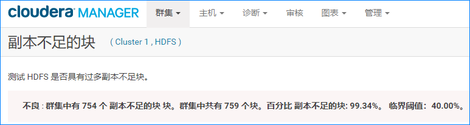
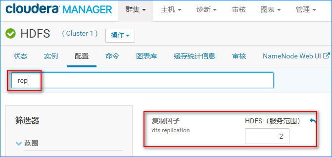

# 1.现象

CDH界面 HDFS出现爆红项，查看详情发现是 **副本数不足**导致的，如下：




**HDFS和 CDH版本**：2.6.0+cdh5.15.1+2822

# 2.分析

报错是很明确的：**接近 99%的 hdfs块副本缺失**。

默认情况下 hdfs的副本一般是3个，要求至少有3个 DataNode。出问题的集群是一个测试集群，之前一共有 3台机器，最近由于一台机器故障，现在集群只剩 2台机器了，问题应该就出在这里了。

**明确一下问题的原因**：

​	集群现有的机器数量不满足 3个 DataNode的要求，故导致副本数不足。

# 3.解决

目前集群只有 2台机器，故只能调低副本数量。具体操作如下：

1. **修改界面配置并重启相关服务**

   

2. **刷新现有文件块的副本数量**

   在 NameNode所在机器执行下面的命令：

   ```shell
   # 刷新现有文件块的数量跟 DataNode一致,2副本
   hdfs dfs -setrep -R 2 /

