# 1.Kibana简介

这里首先对 ELK和 Elastic Stack做一个对比介绍：

- **ELK**

  E, Elasticsearch; L, Logstash; K, Kibana。这是三款软件的简称。

- **Elastic Stack**

  elastic技术栈，在 ELK的基础上增加了 Beats，未来可能还会有新成员加入。

总结下，Elastic Stack是新出现的名称，对 ELK有包含关系。

**本文的主角 kibana具有的能力如下**：

- **分析和可视化数据**

  利用工具分析 es中的数据，编制图表仪表板，利用仪表、地图和其他可视化显示发现的内容。

- **搜索、观察和保护数据**

  向应用和网站添加搜索框，分析日志和指标，并发现安全漏洞。

- **管理、监控和保护 Elastic Stack**

  监控和管理 es集群、kibana等 elastic stack的运行状况，并控制用户访问特征和数据。

kibana和 es的版本有比较严格的依赖关系，这里研究和操作的对象是同为 **7.3.2**版本的 kibana和 es。

# 2.Discover

用于浏览 es索引中的数据，还可以添加筛选条件，查看感兴趣的数据。

下面是一个典型的界面：

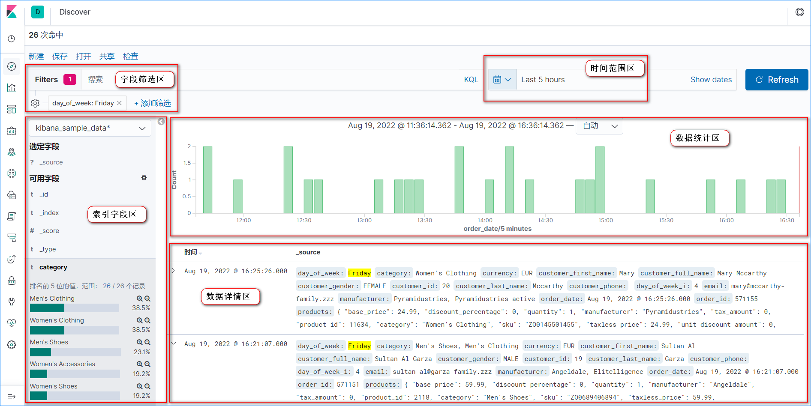

上图红线框将 discover界面分成了几个核心区域：

- **字段筛选区**

  这个区域用于添加索引字段的筛选条件，支持多个筛选条件（注意多个条件是 与的关系，即同时满足），可以方便地筛选出感兴趣的数据，然后再进一步分析。

  如上图，这里的筛选条件是字段 day_of_week=Friday，用于查看每周五的订单信息。

- **索引字段区**

  这个区域展示了符合索引模式的索引蕴含的所有字段，点击字段可以看到一些有用的统计信息。另外，还可以设置字段是否展示到数据摘要中。

  如上图，这里选择把 category字段展开，可以看到前 26条数据中排名前 5的是哪些种类的商品。这里选定字段 _source为默认展示所有字段到数据摘要中，可以手动把需要展示的字段添加到选定字段中，方便查看。

- **时间范围区**

  这个区域用于根据索引模式创建时**选定的时间字段**对数据进行过滤，可以直接选择最近 15分钟、今日、本月等预设的时间范围，也可以自定义时间范围。另外，还可以在这里设定数据的刷新时间，用于观察数据的实时变化情况。

  如上图，这里使用的是自定义时间范围，查看最近 5个小时的数据。

- **数据统计区**

  这个区域用于展示选定的时间范围内数据的分布情况，目前的展示形式只有柱状图。鼠标移上去的时候可以查看一起额外信息，可以单击查看其中某个区域的数据。这个功能很有用，根据一段时间内数据的分布情况可以判断出 处理程序什么时候压力较大、哪个时间数据入库情况异常、哪个时间段程序处于闲置状态等。

  如上图，可以看到数据整体分布较为均匀，数据呈现出间隔一定时间产生的规律。

- **数据详情区**

  这个区域用于展示符合条件的数据列表，默认展示数据的摘要情况，可以和索引字段区的选定字段进行联动。点击左侧的 >符号可以查看数据的详细情况。

  如上图，通过数据摘要可以看到数据的基本情况，加入了筛选条件的字段会被高亮。数据摘要没有进行格式化，可以点击数据详情以更好的格式产看数据细节。

**进阶操作**：

- **快速添加筛选条件**

  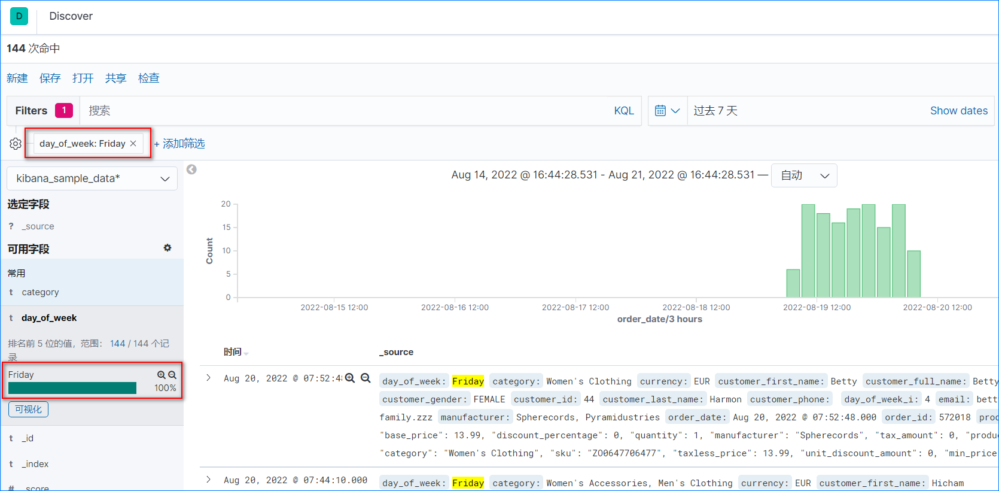

  如上图可以通过点击字段右上角的 '+'号快速添加一个 day_of_week=Friday的查询条件

- **保存与打开搜索**

  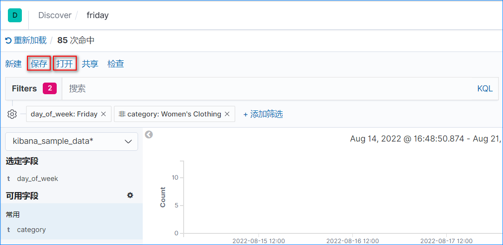

  如上图，左上角的 '保存'和'打开'按钮可以保存当前搜索配置和加载已保存的搜索配置。这个功能对于观察数据状态的变化十分有用，能节约不少时间。

# 3.Visualize

1. **条形图**

   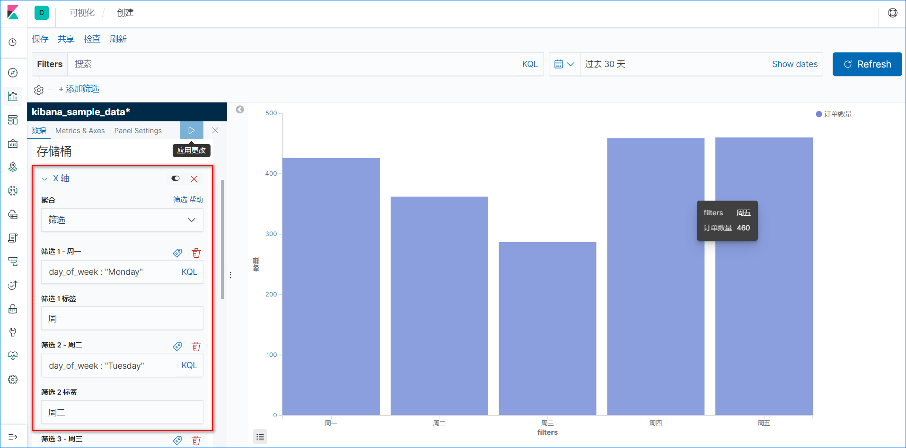

   如上图，该条形图的目的是研究目标索引里面最近一个月每个工作日的订单数量。可以很清晰的看到工作日中周三的订单数量是最少的，而周四和周五是最多的，很方便就得出了一些有用的结论。

   条形图是图表里面比较基础和简单的呈现方式，创建前应该明确 x轴和 y轴的含义。在 kibana里面，存储桶就是设置 x轴，类型有：词、筛选、时间范围等，选定类型后还可以设置其标签。设置完毕后，点击右上方三角形按钮即可应用。

2. **饼图**

   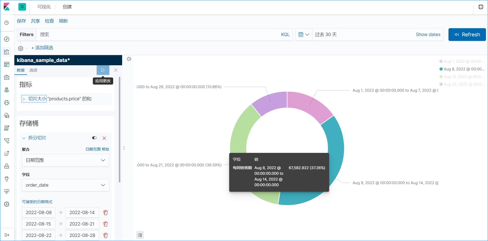

   如上图，该饼图展示了8月份总销售额及各周的销售额情况。可以很清晰的看到单周的销售额与总销售之间关系，比如 单周销售额最高的是8月的第二周，占比37%。

   饼图可以很好的呈现部分与总体、部分之间的比例关系，也是很常见的一种图表。在 kibana中，指标表示总体，存储桶表示部分。可以在设计好总体之后，选择感兴趣的切分方式，用于获取想要的分析结论。

   实际使用过程中，发现 kibana提供的饼图自定义程度还不够高。比如上图中，无法实现通过自定义标签格式达到美化标签的目的。

3. **词云图**（标签云图）

   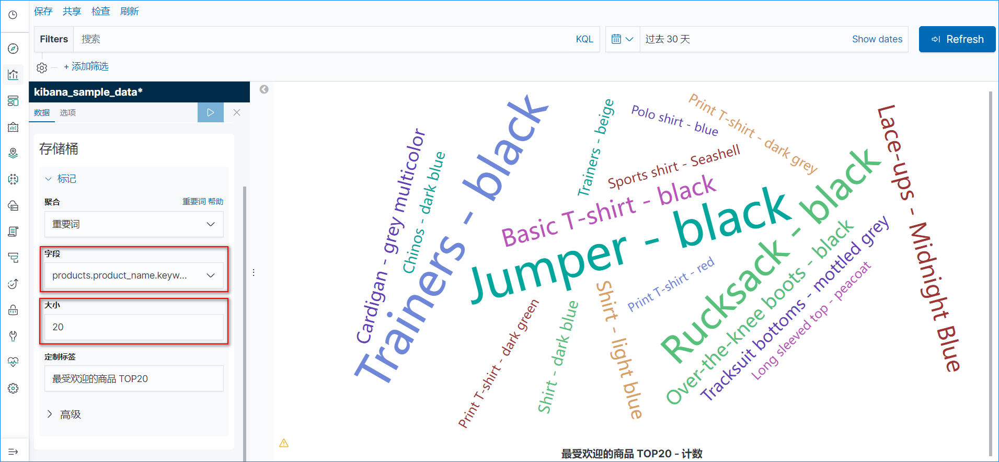

   如上图，这是一张以商品名称为主题的词云图，用于展示最受欢迎的 TOP20商品。字体越大表示商品越受欢迎，颜色则是随机生成没有特殊含义。

   词云图是近些年比较流行的关键词呈现方式，其新颖的表现形式比较容易抓住读者的眼球，常见于各种演示文档。在 kibana里面生成词云图，首先要选择有意义的字段，比如 这里选择商品名称；其次，选择展示多少个关键词，数量应该适中。其他的，还可以设置关键词的方向：水平、垂直、随机，关键词大小范围。

# 4.Console

用 es支持的语法编写查询条件，实现精细化的查询，也可用于测试代码中的查询条件。

下面是一个典型的界面：

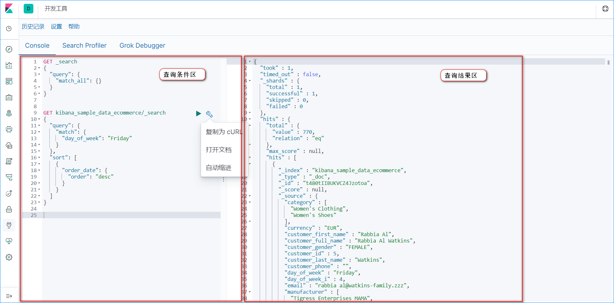

console界面比起 discover界面简单了很多，分为两个核心区域：

- **查询条件区**

  该区域的主要功能是编写查询条件，其自动补全功能十分有用，可以很好的辅助编写查询条件，提升效率与准确度。另外，还可以讲编写好的查询条件进行格式化和转化为 curl请求格式。

  如上图，查询 kibana_sample_data_ecommerce索引中订单日期为周五的数据，并且按照时间逆序排列。

- **查询结果区**

  该区域的功能是仅有一个，展示当前执行查询条件的返回结果，点击左侧三角形可以对数据进行折叠。

  如上图，可以看到从上到下，分别有查询状态、命中数据量、关系和具体命中数据等信息。

# 5.索引模式

这个界面有两个常用的功能：索引管理和索引模式。

1. **索引管理**

   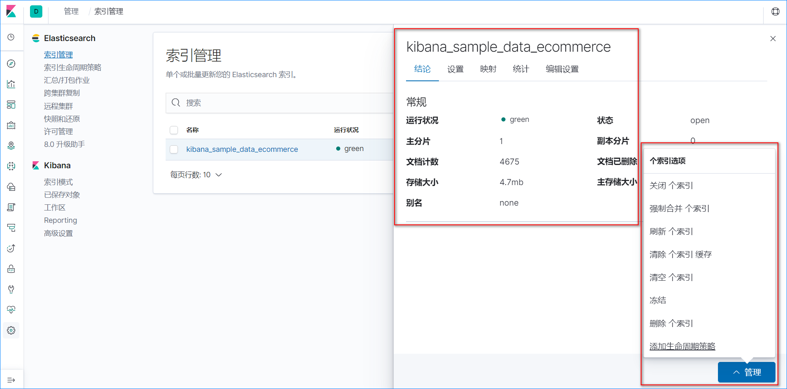

   如上图是一个典型的索引管理界面，可以查看索引的运行状况、状态、主分片和副本分片等信息。另外，还可以对索引执行关闭、合并、刷新、清空和删除等操作，比起用 es原生的命令来管理索引，这个界面可以极大的提高效率。

2. **索引模式**

   这里对索引模式做一个简单的解释：

   ​	索引模式用于匹配命名符合一定规律的单个或多个索引，便于在 discover界面查看和分析目标索引的数据。举个例子，生产上防火墙产生的日志会特别多，通常会按天创建索引（命名样例：firewall-20220821）来存储数据，那么如何查看一周的数据呢？索引模式即可以解决该问题，可以同时查看多个索引的数据。

   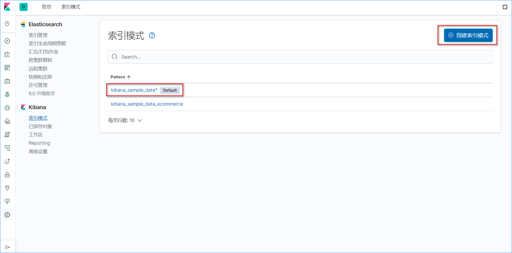

   如上图是一个典型的索引模式界面，可以对索引模式进行查看、创建、修改和删除操作。将索引模式标记为 Default的目的是每次打开 discover界面时，可以直接查看该索引模式里的数据。

# 6.Monitoring

用于管理 elastic技术栈相关的集群状态，比较常见的是管理 es和 kibana本身，下面是一个典型的界面：

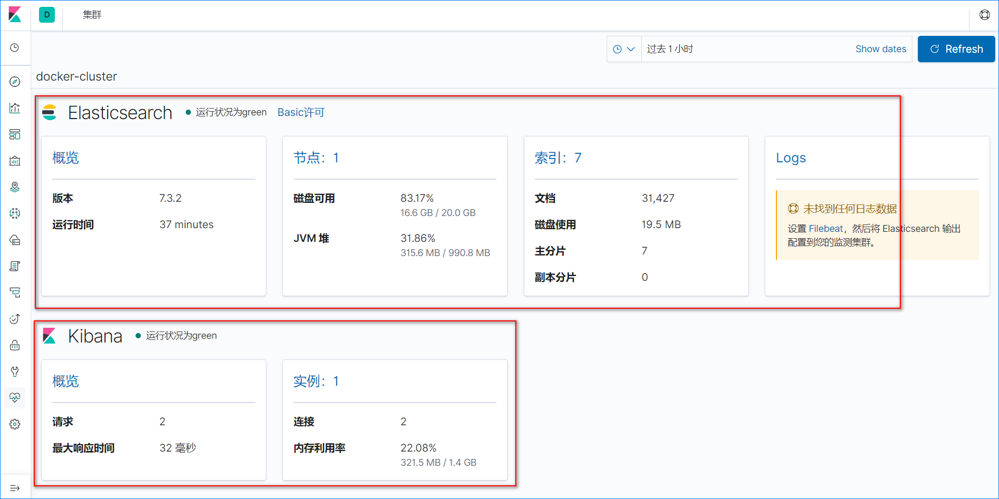

如上图，该界面可以查看 es集群版本、运行时间、节点情况和索引情况等，还可以查看 kibana本身的一些状态。

在生产实践中，还有一个**节点状态界面**十分有用，如下图：

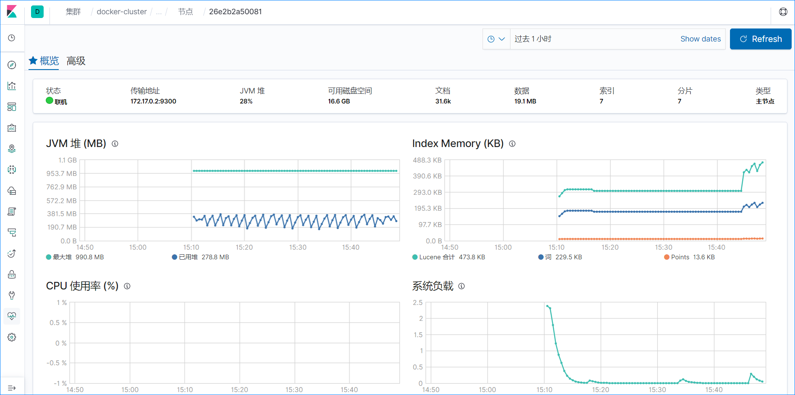

从上图中可以看到 es某个节点的 JVM堆内存使用情况、CPU使用率和系统负载等信息，对于现场排查索引相关问题很有帮助。

# 7.总结

上面介绍的这些 kibana模块都是上次出差**去现场一个月**常用的，非常实用。虽然文章深度还不够，但是日常使用和维护差不多了，现在有时间就总结一部分，后面有时间再深入研究。

