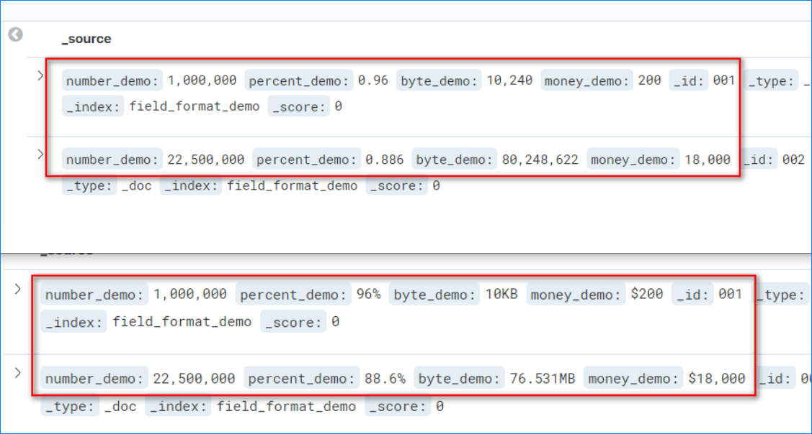
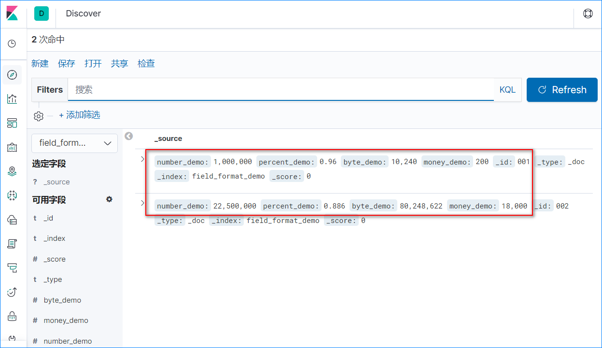
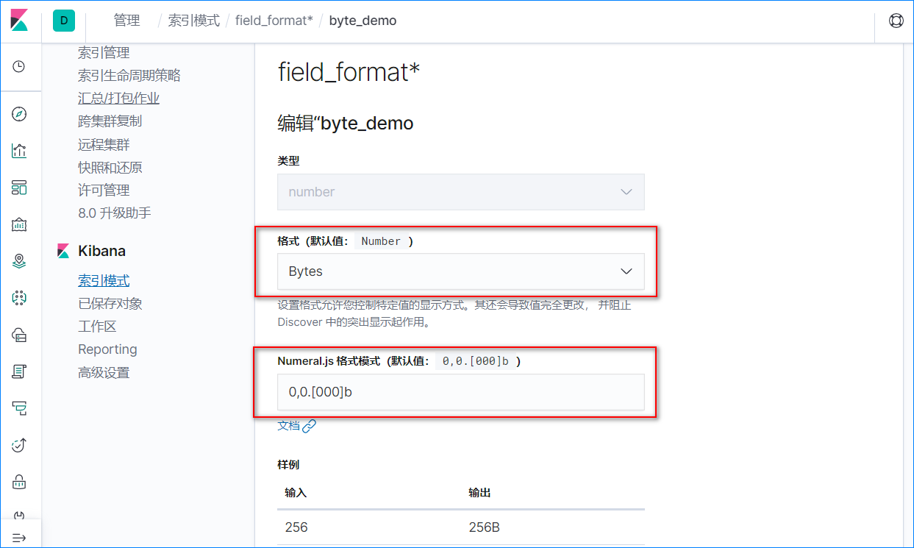
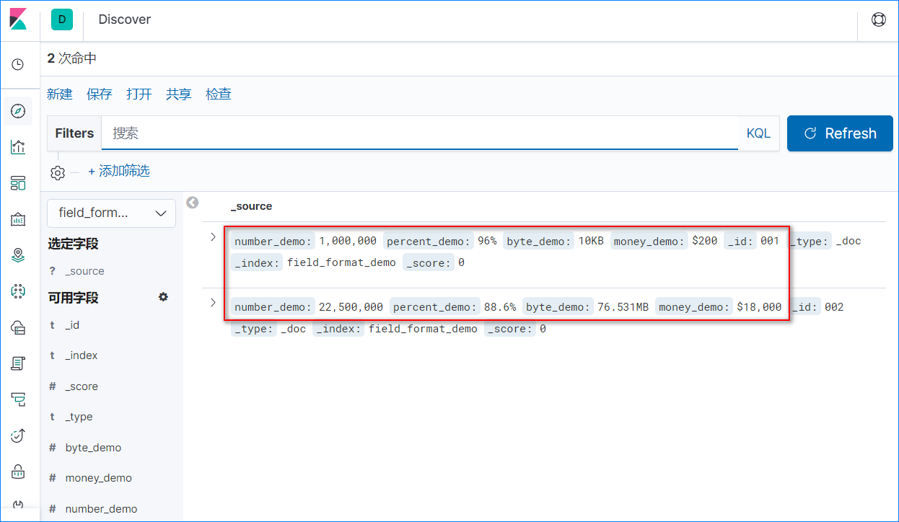

# 1.前言

Kibana的 Discover界面是用于查看 es索引中数据的一个重要手段，不仅可以使用过滤条件筛选感兴趣的数据，还可以使用 KQL实现更加复杂的查询条件。在实际项目中，可以在网页中内嵌该页面，给用户提供自助分析数据的功能。

这里先看一张对比图：



如果不看字段名称，上方的红色框或许很难直接了解字段的含义，而下方红色框的内容则十分明确了。

如何实现下方红色框的显示效果呢，这就是本文要探讨的内容。

# 2.准备测试数据

准备含有 百分比、字节大小和金额的数据如下：

```shell
PUT field_format_demo/_doc/001
{
  "number_demo": 1000000,
  "percent_demo": 0.96,
  "byte_demo": 10240,
  "money_demo": 200
}
PUT field_format_demo/_doc/002
{
  "number_demo": 22500000,
  "percent_demo": 0.886,
  "byte_demo": 80248622,
  "money_demo": 18000
}
```

在 kibana界面上创建一个索引模式 field_format*指向索引 field_format_demo，在 Discover中查看数据如下：



这里假设 percent_demo是一个以小数表示的百分比字段，byte_demo是一个代表字节大小的字段，money_demo是一个代表美元的金额。如上图，在默认情况下，这三个字段的显示效果并不能很好的表达其含义。

# 3.自动修改索引模式

查找第2步中创建的索引模式ID：

```
GET .kibana/_search
{
  "query": {
    "match": {
      "index-pattern.title": "field_format*"
    }
  }
}
```

给索引模式中的字段指定显示效果：

```
POST .kibana_2/_update/index-pattern:9e0da730-5399-11ed-bf93-e7730119fd36
{
  "doc": {
    "index-pattern": {
      "fieldFormatMap": """{"byte_demo":{"id":"bytes"},"money_demo":{"id":"number","params":{"pattern":"$0,0.[000]"}},"percent_demo":{"id":"percent"}}"""
    }
  }
}
```

**什么场景需要使用脚本自动更新索引模式呢？**——很简单，给现场制作升级包的时候

------

**补充，如何在界面上实现同样的效果**：

步骤一：


步骤二：




# 4.最终效果




# 5.总结

生产上，为了方便用户使用 Kibana的 Discover页面进行自助数据分析，通常会使用脚本内置一些索引模式。如果在这个时候优化索引模式中字段的显示效果，则可以有效提升用户体验。另外，更新索引模式的脚本可以用 update_by_query进行替换，会更加简洁，感兴趣的朋友可以自行尝试。


