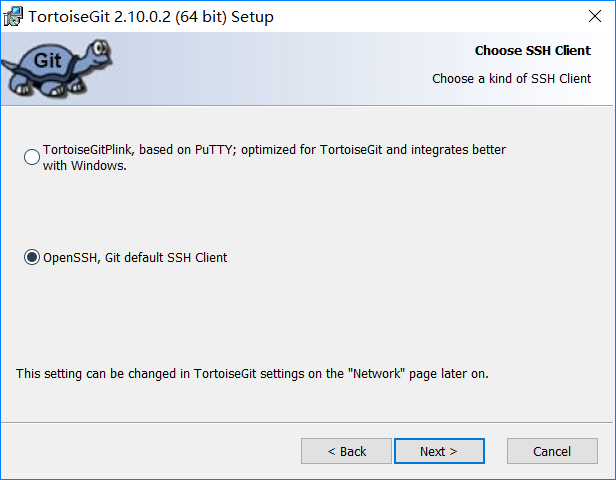

# 1. 序言

市面上有很多的 Git 第三方界面管理工具，为何选择小乌龟（TortoiseGit）呢？可以先看下面的截图：


**操作简单**，**功能强大**，用了之后其他的 Git 管理工具就不太习惯了..

# 2. 文件准备

需要的文件如下，第三个语言包可选：


**下载地址如下**：

1. [Git 官网下载页面](https://gitforwindows.org/)

2. [TotoriseGit 官网下载页面](https://tortoisegit.org/download/)

   喜欢中文菜单码友的可以把中文语言包一起下载下来。

补充：通常官网下载很慢，下不动可以用迅雷试试。另外贴一下某网盘的连接，方便下载：

​	链接：https://pan.baidu.com/s/1XocMyYCiWzdgngb9CTx0jQ 
​	提取码：jid5

# 3. 安装 Git

## 3.1 安装

没有特殊要求的可以一路下一步。

## 3.2 配置用户名和邮箱

1. 打开 git 命令行

   可以在桌面空白处右键，如下图：

   


2. 执行下面的命令

   把下面命令里面的用户名和邮箱替换下

   ```shell
   git config --global user.name "<name>"
   git config --global user.email "<email>"
   ```

## 3.3 打开 GitHub 添加公钥

打开 git 命令行：

```shell
# 下面这个文件的内容就是 ssh 公钥
cat ~/.ssh/id_rsa.pub
```

在这个位置添加公钥：**Settings>>SSH and GPG keys**

# 4. 安装 TortoiseGit

## 4.1 安装

没有什么特别的，在下面这个界面建议选择 ssh ，其他一路下一步即可:



## 4.2 配置 SSH 私钥

在程序安装目录的 bin 目录下找到 puttygen.exe ，然后按照下图所示导入之前生成的私钥并保存成 ppk 格式：


## 4.3 配置 Pageant 实现 SSH 免密码登录

Pageant 在 TortoiseGit 中负责和服务端验证，通过加载含有私钥的 ppk 文件来完成验证。

因为只有 pageant 正常运行，才可以免密码登录，所以最好把它设为开机自启，并自动加载 ppk 文件，否则每天上班开机后就得手动去起，会很痛苦。

**配置步骤如下**：

1. 同样是在 TortoiseGit 安装目录的 bin 目录下找到 pageant.exe ,然后生成快捷方式。

2. 右键快捷方式把含有私钥信息的 ppk 文件路径加上去，如下：

   

3. 把快捷方式放到 windows 启动文件夹

   win10 的启动文件夹在：C:\ProgramData\Microsoft\Windows\Start Menu\Programs\StartUp ，其他的可以自己找下位置

# 5. 验证环境

找一个自己的 git 项目，如果可以用小乌龟正常克隆下来，说明配置成功。


