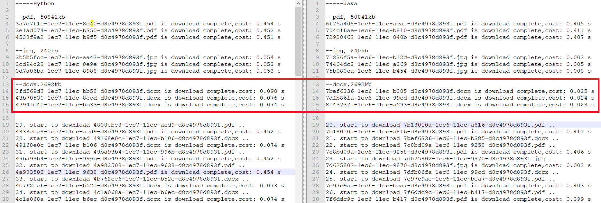

# 1. 前言

最近由于业务需求，需要使用 Python下载 FastDFS上的文件。一开始看到 Python有第三方包可以用就直接上了，但是需要处理的文件数量实在太大，导致经常出现文件积压的情况。经过分析，发现文件的下载速度是影响较大的因素之一，所以第一个程序调优思路就定为研究如何提高文件的下载速度。

通过查阅资料，发现 FastDFS是使用 Java编写的，作者只提供了 Java版本的客户端，而 Python的客户端则是由其他开发者编写的。那么一个疑问就随之而来：会不会使用 Java下载文件会更快？

# 2. 构造 Python需要用的 jar包

这里使用的是 github作者 Happy Fish / YuQing提供的开源 Java代码。

由于 Python只能调用 Java中的静态方法，所以需要将下载文件的代码封装成一个静态方法，代码如下：

```java
package com.daphnis.fdfs;

import org.csource.common.MyException;
import org.csource.fastdfs.*;

import java.io.IOException;

public class FdfsClient {

    private static TrackerServer trackerServer;
    private static StorageClient storageClient;

	// 做一些初始化工作
    public static void init(String dfsConfFile) throws IOException, MyException {
        ClientGlobal.init(dfsConfFile);
        System.out.println("ClientGlobal.configInfo(): " + ClientGlobal.configInfo());

        TrackerClient tracker = new TrackerClient();
        trackerServer = tracker.getTrackerServer();
        storageClient = new StorageClient(trackerServer, null);
    }

	// 下载 fastdfs文件
    public static void downloadFile(String group,String dfsPath,String localPath) throws IOException, MyException {
        storageClient.download_file(group,dfsPath,new DownloadFileWriter(localPath));
    }

    public static void main(String... args){
        try {
            init("fdfs-client.conf");
            downloadFile("group1","123","321.pdf");
        } catch (Exception e) {
            e.printStackTrace();
        }
    }
}
```

然后使用 maven将代码和其依赖项打包成一个 jar包即可。

# 3. 使用 Python调用 Java下载 FastDFS上的文件

使用 Python调用 Java依赖 JPype1，这里使用的是 1.2.1版本的 JPype1。

核心代码是如何去构造 Java对象，如下：

```python
import jpype

# 在 Linux上推荐直接指定 libjvm.so的位置，不要用 getDefaultJVMPath()
JVM_SO_PATH = jpype.getDefaultJVMPath()
JAR_PATH = 'lib/fastdfs-client-java-1.28.jar'

jpype.startJVM(JVM_SO_PATH, '-ea', '-Djava.class.path={}'.format(JAR_PATH))
self.fdfs_client = jpype.JClass('com.daphnis.fdfs.FdfsClient')
self.fdfs_client.init(fdfs_config)
```

Java对象构造好后，下载文件就很简单了：

```python
self.fdfs_client.downloadFile(group, dfs_path, target_file)
```

# 4. 使用 Python和 Java分别下载文件结果对比

先贴一下实验结果：



左侧是只用 Python直接去下载 fastdfs文件，使用的是 [pypi.org](https://pypi.org/project/py3Fdfs/#modal-close)提供的 FastDFS Python客户端；右侧则是使用 Java间接下载 fastdfs文件。

实验流程是分别使用 Python和 Java去随机100次下载三种不同类型的文件。如上图，从100次下载结果里面随机选了一些结果进行对比。以 docx类型的文件为例，文件大小是 2692kb，左侧 Python平均耗时 83毫秒，右侧 Java平均耗时 24毫秒。

这个一对比差距就太大了，Java比起 Python下载速度提升了 (83-24)/83约等于 **70%**，这个效率提升就有点恐怖了。

# 5. 总结

通过研究和实验对比，结论确实使用 Java下载 FastDFS上的文件比 Python快很多，虽然会增加一些程序的复杂度，但是比起提升的下载速度，笔者认为是非常划算的。另外，想要完整代码的小伙伴可以移步 github:  https://github.com/Daphnis-z/py-fdfs-java ，觉得不错的话可以随手来颗星星。


