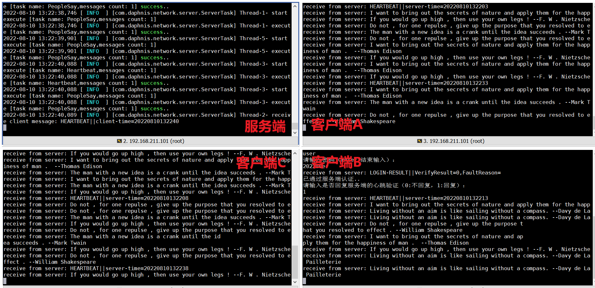
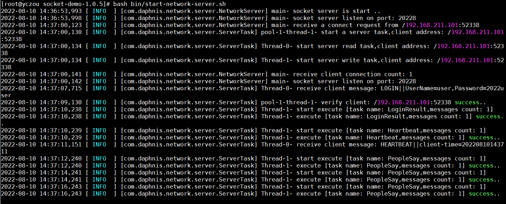
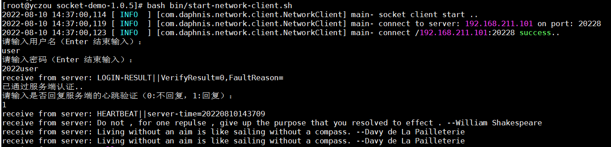

# 1.前言

之前一直对 java使用 socket进行直接通讯比较感兴趣，这次趁着高温假，正好把这块给研究下，最后实现效果见下图：



# 2.程序功能简介

1. **支持服务端和客户端直接使用 socket进行双向通讯**

   服务端可以指定一个端口进行侦听，客户端使用 socket连接该端口后，双方可以互发消息。

2. **支持客户端认证**

   程序集成了 mybatis，可以使用 mysql中存储的账号信息对客户端进行认证。

3. **支持多客户端**

   服务端采用多线程设计，可以同时连接多个客户端。

4. **支持心跳检测**

   服务端会定时给客户端发送心跳包，客户端收到后需要回复。对于多次没有回复心跳包的客户端，服务端会主动关闭连接。

5. **支持 Linux脚本启动**

   程序打包机制比较完善，打包成功后会生成一个 tar.gz格式的压缩包，传输到 linux后可以使用 bin目录的脚本一键启动程序。

# 3.程序实现介绍

**这一节只给出了部分核心代码，完整代码可以到最后 5.总结 里面找到 github地址获取。**

**主要依赖**：

​	JDK1.8，MySql5.7.36，MyBatis3.4.5

## 3.1 服务端和客户端通过 Socket通讯

**服务端实现代码**：

```java
try (ServerSocket serverSocket = new ServerSocket(ConfigUtil.getServerPort())) {
  while (true) {
	LOG.info("socket server listen on port: " + serverSocket.getLocalPort());

	Socket socket = serverSocket.accept();
	++connectionCount;

	String clientAddress = socket.getInetAddress().getHostAddress();
	LOG.info("receive a connect request from " + socket.getRemoteSocketAddress());

	ServerTask serverTask = new ServerTask(socket);
	executorService.submit(serverTask);

	ServerTaskCache.clientAddress2ServerTask.put(clientAddress, serverTask);
	LOG.info("receive client connection count: " + connectionCount);
  }
} catch (Exception e) {
  LOG.error("socket server error !!", e);
}
```

**客户端实现代码**：

```sh
Socket socket = new Socket(serverName, ConfigUtil.getServerPort());
LOG.info(String.format("connect %s success..", socket.getRemoteSocketAddress()));

BufferedReader bufferReader = new BufferedReader(
  new InputStreamReader(socket.getInputStream(), Charsets.UTF_8));
BufferedWriter bufferWriter = new BufferedWriter(
  new OutputStreamWriter(socket.getOutputStream(), Charsets.UTF_8));
```

## 3.2 客户端认证功能

**mybatis数据库配置**：

```xml
<environment id="mysql">
  <transactionManager type="JDBC"></transactionManager>
  <dataSource type="POOLED">
	<property name="driver" value="${driver}"/>
	<property name="url" value="${url}"/>
	<property name="username" value="${username}"/>
	<property name="password" value="${password}"/>
  </dataSource>
</environment>
```

**从数据库查询账号数据**：

```java
/**
* 从数据库中查询账户信息
*
* @param userName
* @return
*/
public static Account queryAccount(String userName) {
try (SqlSession sqlSession = openSession()) {
  AccountMapper accountMapper = sqlSession.getMapper(AccountMapper.class);
  return accountMapper.selectOneAccount(userName);
} catch (Exception e) {
  LOG.error("query account from db error !!", e);
}

return new Account();
}
```

## 3.3 多客户端支持

把跟客户端的交互都封装到一个类里面，然后用线程池去调度：

```java
public class ServerTask implements Runnable {

  private static Logger LOG = LoggerFactory.getLogger(ServerTask.class);

  Heartbeat heartbeat = new Heartbeat();
  boolean stopTask = false;

  Socket socket;
}

# 线程池
ExecutorService executorService = Executors.newCachedThreadPool();
ServerTask serverTask = new ServerTask(socket);
executorService.submit(serverTask);
```

## 3.4 心跳检测机制

```java
if (System.currentTimeMillis() - lastHeartTime >= heartIntervalMillis) {
  // 做心跳检测
  if (heartbeat.isSendHeart()) {
	if (heartbeat.isReceiveHeart()) {
	  heartbeat = new Heartbeat();
	}

	heartbeat.setFailTimes(heartbeat.getFailTimes() + 1);
	if (heartbeat.getFailTimes() >= ConfigUtil.getHeartLimitTimes()) {
	  SocketUtil.writeMessage2Stream(
		  String.format("连续 %s个心跳包没有收到客户端的回复，服务端即将关闭连接！", heartbeat.getFailTimes()),
		  bufferWriter);
	  LOG.warn(String.format("do not get heartbeat reply from client %s times !",
		  heartbeat.getFailTimes()));
	  stopTask = true;
	}
  }

  // 发送心跳包
  String heartMsgs = ProtocolUtil.createHeartMsg();
  writeTaskQueue.add(new WriteTask("Heartbeat", Lists.newArrayList(heartMsgs)));
  heartbeat.setSendHeart(true);
  lastHeartTime = System.currentTimeMillis();
}
```

## 3.5 程序打包和运行脚本

**下面是部分核心打包配置，完整配置见 release.xml**

```xml
<formats>
  <format>tar.gz</format>
  <format>dir</format>
</formats>

<dependencySets>
  <dependencySet>
    <outputDirectory>/lib</outputDirectory>
  </dependencySet>
</dependencySets>
```

**启动脚本不仅要指定 jar包路径，还要指定资源文件路径**：

```shell
java -cp config:lib/* com.daphnis.network.NetworkServerMain
```

脚本执行方式是进到程序根目录，然后执行下面的脚本：

```shell
bash bin/start-network-server.sh
```

# 4.程序最终效果

1. **服务端效果**

   

2. **客户端效果**

   

# 5.总结

本文在 java socket通讯的基础上，适当扩展了 客户端认证、多客户端支持、心跳检测等功能，完整代码见 github: [Socket Demo](https://github.com/Daphnis-z/notejtd/tree/master/socket/socket-demo)


